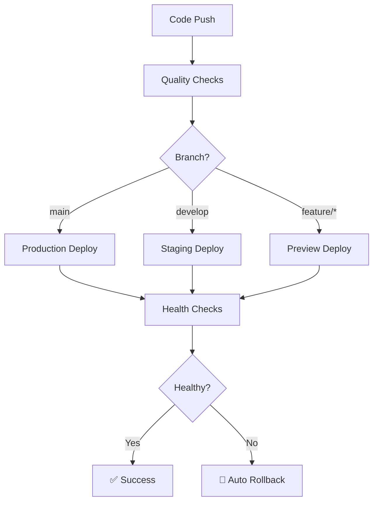

# 🚀 Pathfinder CI/CD Pipeline

**Complete GitHub Actions CI/CD pipeline for Pathfinder with Azure Container Apps deployment**

## 📋 What's Included

### Two Pipeline Versions

#### 🟢 Simple Pipeline (`ci-cd-simple.yml`)
- ✅ Frontend & Backend linting and testing
- 🐳 Docker build and push to GitHub Container Registry
- 🌐 Azure infrastructure deployment via Bicep
- 🚀 Container Apps deployment
- 🏥 Basic health checks and notifications

#### 🟡 Enhanced Pipeline (`ci-cd-enhanced.yml`)
- 🌍 **Multi-environment support** (dev, staging, prod, preview)
- 🔒 **Advanced security scanning** (Trivy, CodeQL)
- ⚡ **Intelligent caching** and parallel execution
- 🔄 **Blue/green deployment** with automatic rollback
- 📊 **Performance monitoring** and comprehensive health checks
- 🧹 **Preview environment cleanup** for feature branches

### Supporting Tools

- 🛠️ **Automated setup script** (`scripts/setup-ci-cd.sh`)
- 📚 **Comprehensive documentation** (`docs/CI_CD_*.md`)
- 🔧 **GitHub secrets templates** with security best practices

## 🚀 Quick Start

### 1. Run Setup Script
```bash
./scripts/setup-ci-cd.sh
```

### 2. Configure GitHub Secrets
Follow the generated template to set up required secrets in your GitHub repository.

### 3. Enable Pipeline
```bash
# Start with simple pipeline
mv .github/workflows/ci-cd-simple.yml .github/workflows/ci-cd-pipeline.yml
git add . && git commit -m "feat: implement CI/CD pipeline" && git push
```

## 🎯 Pipeline Triggers

| Event | Simple Pipeline | Enhanced Pipeline |
|-------|----------------|-------------------|
| **Push to `main`** | ✅ Deploy to Production | ✅ Deploy to Production |
| **Push to `develop`** | ✅ Quality checks only | ✅ Deploy to Staging |
| **Feature branches** | ✅ Quality checks only | ✅ Deploy to Preview Environment |
| **Pull requests** | ✅ Quality checks only | ✅ Quality checks only |
| **Manual dispatch** | ❌ Not supported | ✅ Deploy to any environment |

## 🏗️ Infrastructure

The pipeline automatically creates and manages:

- **Azure Container Apps** (frontend + backend)
- **Azure SQL Database** (relational data)
- **Azure Cosmos DB** (document storage)
- **Redis Cache** (performance layer)
- **Application Insights** (monitoring)
- **Key Vault** (secrets management)

## 📊 Quality Gates

- **Backend**: flake8, black, mypy, isort, pytest with coverage
- **Frontend**: ESLint, TypeScript checking, Vitest with coverage
- **Security**: Trivy vulnerability scanning, CodeQL analysis
- **Performance**: Response time monitoring, health checks

## 🌍 Multi-Environment Strategy

| Environment | Branch | Purpose |
|-------------|--------|---------|
| **Production** | `main` | Live application |
| **Staging** | `develop` | Pre-production testing |
| **Preview** | `feature/*` | Feature testing |
| **Dev** | Manual dispatch | Development work |

## 🔄 Deployment Flow



## 📈 Key Features

### 🔍 Change Detection
Only builds and deploys changed components (frontend/backend/infrastructure).

### ⚡ Performance Optimizations
- **Dependency caching** (npm, pip, Docker layers)
- **Parallel execution** of quality checks
- **Incremental builds** with change detection

### 🛡️ Security & Compliance
- **Secret management** with Azure Key Vault integration
- **Automated vulnerability scanning**
- **Code quality enforcement**
- **RBAC and least privilege access**

### 🔄 Rollback & Recovery
- **Automatic rollback** on health check failures
- **Manual rollback capability** for any environment
- **Blue/green deployment** strategy
- **Comprehensive logging** for troubleshooting

## 📚 Documentation

| Document | Purpose |
|----------|---------|
| [`CI_CD_PIPELINE.md`](docs/CI_CD_PIPELINE.md) | Complete pipeline documentation |
| [`CI_CD_IMPLEMENTATION_GUIDE.md`](docs/CI_CD_IMPLEMENTATION_GUIDE.md) | Step-by-step setup guide |
| [`PROJECT_METADATA.md`](docs/PROJECT_METADATA.md) | Project architecture and design |

## 🛠️ Maintenance

### Regular Tasks
- 🔑 **Rotate secrets** every 90 days
- 📊 **Monitor costs** and optimize resources
- 🔍 **Review security scans** and update dependencies
- 📈 **Analyze pipeline performance** and optimize

### Monitoring
- **Pipeline metrics** via GitHub Actions insights
- **Application performance** via Azure Application Insights
- **Cost tracking** via Azure Cost Management
- **Security alerts** via GitHub Security tab

## 🎉 Benefits

✅ **Faster deployments** with automated quality checks  
✅ **Reduced errors** through comprehensive testing  
✅ **Multi-environment support** for safe releases  
✅ **Cost optimization** through intelligent resource management  
✅ **Security compliance** with automated scanning  
✅ **Easy rollbacks** for quick recovery  
✅ **Comprehensive monitoring** for operational excellence  

## 🔗 Related Projects

- [Pathfinder Frontend](frontend/) - React + TypeScript SPA
- [Pathfinder Backend](backend/) - FastAPI + Python 3.12
- [LLM Orchestration](llm_orchestration/) - Multi-provider AI service
- [Infrastructure](infrastructure/) - Bicep templates for Azure

---

**Built with ❤️ for the Pathfinder project by following industry best practices and Azure Well-Architected Framework principles.** 