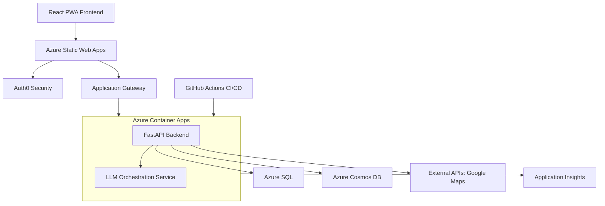

# Pathfinder Project Metadata

**Document Version:** 2.0  
**Last Updated:** June 2025  
**Maintainer:** Vedprakash Mishra  

---

## 1. Project Overview

**Pathfinder** is an AI-powered platform that simplifies the coordination of multi-family group trips. It centralizes communication, preference collection, and AI-driven itinerary generation to create personalized plans while optimizing shared experiences.

- **Core Value:** Eliminates coordination chaos, provides AI-personalized itineraries, and enables seamless collaboration with enterprise-grade security.
- **Production URL (Frontend):** `https://pathfinder-frontend.yellowdune-9b8d769a.eastus.azurecontainerapps.io`
- **Production URL (Backend):** `https://pathfinder-backend.yellowdune-9b8d769a.eastus.azurecontainerapps.io`

---

## 2. System Architecture

The system is a monorepo containing a React PWA frontend, a FastAPI backend, and a dedicated LLM Orchestration service. It is deployed on Azure using a cost-optimized, solo-developer CI/CD pipeline.

### 2.1 Technology Stack

| Layer                 | Technologies                                                                                             |
| --------------------- | -------------------------------------------------------------------------------------------------------- |
| **Frontend**          | React 18 (TypeScript), Vite, Tailwind CSS, Fluent UI v9, Zustand, React Query, PWA                       |
| **Backend**           | FastAPI (Python 3.12+), Pydantic v2, SQLAlchemy, Alembic, Socket.IO                                        |
| **AI & Intelligence** | Custom LLM Orchestration Service; supports OpenAI, Gemini, Claude                                        |
| **Data Storage**      | **Hybrid Model:** Azure SQL (Relational: users, trips) & Azure Cosmos DB (Documents: itineraries, chat) |
| **Infrastructure**    | Azure Container Apps, Azure Key Vault, Application Insights, Docker, Bicep (IaC)                         |
| **CI/CD**             | GitHub Actions (Optimized for solo developer)                                                            |
| **Authentication**    | Auth0 (Zero-Trust Security Model)                                                                        |

### 2.2 Architecture Diagram

---

## 3. Key Features & Functionality

### 3.1 Core Features
- **AI Itinerary Generation**: GPT-4 powered personalized trip planning.
- **Multi-Family Coordination**: Role-based access and family-specific preferences.
- **Real-Time Collaboration**: WebSocket chat with live presence.
- **Budget Management**: Transparent cost tracking and expense splitting.

### 3.2 Pain Point Solutions (Completed June 2025)
- **Family Consensus Engine**: AI-powered conflict resolution to reduce planning time by ~75%.
- **Smart Coordination Automation**: Event-driven notifications to reduce manual overhead by ~80%.
- **Real-Time Feedback Integration**: Live, collaborative editing with instant impact analysis.

---

## 4. Design & Development Principles

| Category                  | Principles                                                                                   |
| ------------------------- | -------------------------------------------------------------------------------------------- |
| **Software Architecture** | SOLID, DRY, Separation of Concerns, Dependency Injection, Event-Driven.                      |
| **Security-First Design** | Zero-Trust Architecture, Defense in Depth, Secure by Default, Principle of Least Privilege.  |
| **Performance & Scalability** | Performance-First (<2s response), Horizontal Scalability, Multi-Layer Caching, Async Processing. |
| **User Experience**       | Progressive Web App (PWA), Accessibility (WCAG 2.1 AA), Responsive Design, Real-Time Feedback.  |

---

## 5. Key Design Decisions

| Decision                               | Rationale                                                                               |
| -------------------------------------- | --------------------------------------------------------------------------------------- |
| **Monorepo Structure**                 | Simplified CI/CD, shared types (`/shared`), and better code coherence.                  |
| **Hybrid Database (SQL + Cosmos)**     | Use best of relational and document storage for performance.                            |
| **Custom LLM Orchestration**           | Optimize costs, support multiple providers, and maintain fine-grained control.          |
| **Auth0 for Authentication**           | Leverage professional security, save weeks of development time, and focus on core features. |
| **Solo Developer CI/CD**               | Single production environment pipeline to reduce costs by 70% and speed up iteration.   |
| **Redis-Free Caching Architecture**    | Replaced Redis with a SQLite/in-memory hybrid to save ~$40/month.                       |
| **Build-Time Frontend Configuration**  | Accommodate Vite's build process for environment variables.                               |

---

## 6. Current Status, Roadmap & Risks

### 6.1 Current Status & Immediate Priorities
- **Status:** All core features and pain-point solutions are **100% complete and deployed**. Critical infrastructure issues (missing databases) have been resolved.
- **Priorities:**
    1.  **Finalize LLM Service Integration:** Connect the deployed service to the backend.
    2.  **Launch Beta Program:** Recruit 5-10 families for real-world validation.
    3.  **Enhance Monitoring:** Implement detailed user analytics and performance tracking.

### 6.2 High-Level Roadmap
- **Phase 2 (Current):** Beta testing, mobile responsiveness improvements, user onboarding optimization.
- **Phase 3 (6-12 months):** Consider mobile app (if usage > 40%), advanced AI features, and enterprise-level multi-tenancy based on beta feedback and user growth.

### 6.3 Key Risks
- **LLM Service Costs:** Mitigated by custom orchestration service with budget caps and provider rotation.
- **User Adoption:** Mitigated by focusing on ease-of-use and preparing simplified onboarding flows.
- **Azure Spending:** Mitigated with cost-optimized architecture and spending alerts.

---

## 7. Development Workflow & CI/CD

- **Git Strategy:** Solo-developer optimized. Direct work on `main` (production), with optional `feature/` branches for experiments.
- **CI/CD Pipeline (`.github/workflows/ci-cd-pipeline.yml`):**
    1.  **Lint & Test:** Frontend and backend quality checks run in parallel.
    2.  **Build:** Docker images for frontend and backend are built in parallel.
    3.  **Security Scan:** Trivy and Gitleaks scans for vulnerabilities.
    4.  **Deploy:** Smart deployment to Azure Container Apps (infrastructure updated only if `/infrastructure` files change).
- **Setup:** Run `make setup` to install dependencies and `make dev` to start the local environment.

---

## 8. API & Data Models Summary

- **API Documentation:** The backend API is self-documenting. See the live endpoints for full details:
    - **Swagger UI:** `/docs`
    - **ReDoc:** `/redoc`
- **Data Models:** Core models are defined with Pydantic in the backend and TypeScript in the `/shared` directory. The database schema is managed with Alembic migrations in `/backend/alembic`.

---

## 9. Glossary

- **Trip Organizer:** The primary user responsible for trip coordination.
- **Family Unit:** A group of related users traveling together.
- **LLM Orchestration:** The service layer that manages AI provider selection and cost optimization.
- **Zero-Trust:** A security model requiring strict verification for every person and device.
- **RU/s:** Request Units per second, a measure of Cosmos DB throughput. 