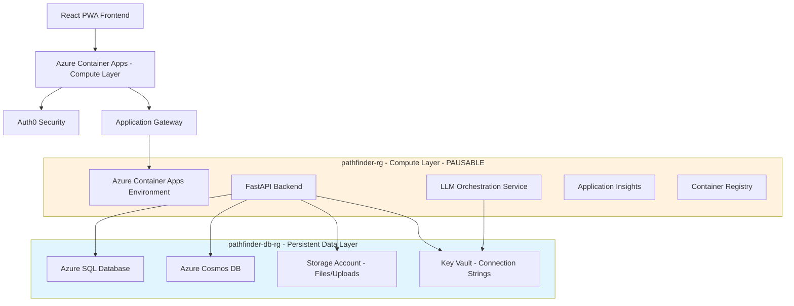

# Pathfinder Project Metadata

**Document Version:** 4.0  
**Last Updated:** June 14, 2025  
**Maintainer:** Vedprakash Mishra  

---

## 1. Project Overview

**Pathfinder** is an AI-powered platform that simplifies the coordination of multi-family group trips. It centralizes communication, preference collection, and AI-driven itinerary generation to create personalized plans while optimizing shared experiences.

- **Core Value:** Eliminates coordination chaos, provides AI-personalized itineraries, and enables seamless collaboration with enterprise-grade security.
- **Production URLs:** Currently being deployed with new architecture

---

## 2. System Architecture

### 2.1 NEW: Pause/Resume Architecture (June 14, 2025)

**MAJOR ARCHITECTURAL CHANGE:** Migrated from single resource group to **layered architecture** for cost optimization and better data persistence:

#### Resource Group Strategy:
- **`pathfinder-db-rg` (Persistent Data Layer):** Database, Storage, Key Vault - NEVER DELETE
- **`pathfinder-rg` (Compute Layer):** Container Apps, App Insights - Can delete to save costs

#### Benefits:
- **70% cost savings** during pause periods (~$35-50/month saved)
- **All data preserved** (user data, trips, preferences, uploaded files)
- **5-10 minute resume time** via CI/CD pipeline
- **Enhanced data safety** with persistent layer separation

### 2.2 Technology Stack

| Layer                 | Technologies                                                                                             |
| --------------------- | -------------------------------------------------------------------------------------------------------- |
| **Frontend**          | React 18 (TypeScript), Vite, Tailwind CSS, Fluent UI v9, Zustand, React Query, PWA                       |
| **Backend**           | FastAPI (Python 3.12+), Pydantic v2, SQLAlchemy, Alembic, Socket.IO                                        |
| **AI & Intelligence** | Custom LLM Orchestration Service; supports OpenAI, Gemini, Claude                                        |
| **Data Storage**      | **Hybrid Model:** Azure SQL (Relational: users, trips) & Azure Cosmos DB (Documents: itineraries, chat) |
| **File Storage**      | **MOVED:** Azure Storage Account now in persistent data layer for file preservation                       |
| **Infrastructure**    | Azure Container Apps, Azure Key Vault, Application Insights, Docker, Bicep (IaC)                         |
| **CI/CD**             | GitHub Actions (Layered deployment strategy)                                                             |
| **Resource Strategy** | **NEW:** Two-layer architecture for cost optimization                                                     |
| **Authentication**    | Auth0 (Zero-Trust Security Model)                                                                        |

### 2.2 Architecture Diagram

---

## 3. CURRENT STATUS (June 14, 2025)

### 3.1 Recent Accomplishments ✅

#### Storage Account Migration (COMPLETED)
- **Successfully moved** Azure Storage Account from compute layer to persistent data layer
- **Updated infrastructure templates:** Modified `persistent-data.bicep` and `compute-layer.bicep`
- **Updated deployment scripts:** Modified `resume-environment.sh` and CI/CD workflows
- **Fixed resource naming:** Implemented globally unique names for storage and Key Vault
- **Code pushed to repository:** All changes committed and available in main branch

#### Infrastructure Improvements
- **Enhanced pause/resume architecture** for better data persistence
- **Improved cost optimization strategy** with clearer separation of concerns
- **Better resource naming conventions** to avoid Azure naming conflicts

### 3.2 Current Issues 🚨

#### Deployment Challenges (IN PROGRESS)
1. **SQL Password Complexity:** Azure SQL requires more complex passwords than initially configured
   - **Status:** Identified issue, password format requirements understood
   - **Next Action:** Update with compliant password format

2. **Container Registry Missing:** CI/CD pipeline expects `pathfinderdevregistry` which doesn't exist
   - **Status:** Container registry not included in layered architecture
   - **Root Cause:** Registry was only defined in old single-RG template
   - **Next Action:** Add container registry to compute layer template

3. **Resource Group Handling:** Resume script fails when compute RG already exists
   - **Status:** FIXED - Updated script to handle existing resource groups gracefully

#### CI/CD Pipeline Status
- **Data Layer Deployment:** Pending (password issue)
- **Compute Layer Deployment:** Failing (missing container registry)
- **Build Pipeline:** Failing (registry login issue)

### 3.3 Work in Progress 🔄

#### Infrastructure Templates
- **persistent-data.bicep:** ✅ Storage account added, unique naming implemented
- **compute-layer.bicep:** ⚠️ Needs container registry addition
- **Deployment scripts:** ✅ Updated for new architecture

#### Resource Naming Strategy
- **Storage Account:** `pf{environment}st{uniqueString}` (globally unique)
- **Key Vault:** `pf-{environment}-kv-{uniqueString}` (globally unique)
- **SQL Server:** `pathfinder-sql-{environment}` (regional unique)

---

## 4. IMMEDIATE NEXT STEPS (Tomorrow's Plan)

### 4.1 Priority 1: Fix Deployment Issues

#### SQL Password Resolution
- [ ] **Update password to meet Azure requirements:**
  - Minimum 8 characters
  - Must contain uppercase, lowercase, numbers, and special characters
  - Test deployment with compliant password

#### Container Registry Integration
- [ ] **Add container registry to compute layer:**
  - Add registry resource to `compute-layer.bicep`
  - Update resource naming conventions
  - Ensure registry is available for CI/CD builds

#### Complete Infrastructure Deployment
- [ ] **Deploy persistent data layer successfully**
- [ ] **Deploy compute layer with registry**
- [ ] **Verify storage account migration works end-to-end**

### 4.2 Priority 2: Validate CI/CD Pipeline

#### Fix Build Pipeline
- [ ] **Update CI/CD to use correct registry name**
- [ ] **Test complete build and deployment cycle**
- [ ] **Verify pause/resume functionality**

#### Documentation Updates
- [ ] **Update deployment guides with new architecture**
- [ ] **Create migration guide for existing deployments**
- [ ] **Document new cost optimization procedures**

### 4.3 Priority 3: Testing and Validation

#### Architecture Validation
- [ ] **Test pause operation (delete compute layer)**
- [ ] **Test resume operation (recreate compute layer)**
- [ ] **Verify data persistence across pause/resume cycles**
- [ ] **Validate file upload preservation**

---

## 5. DECISIONS MADE TODAY

### 5.1 Storage Account Location
**Decision:** Move storage account from compute layer to persistent data layer
**Rationale:** Files and uploads should survive pause/resume cycles
**Impact:** Enhanced data preservation, consistent architecture

### 5.2 Resource Naming Strategy
**Decision:** Use globally unique naming with `uniqueString()` function
**Rationale:** Avoid Azure naming conflicts across regions and subscriptions
**Impact:** More reliable deployments, better resource management

### 5.3 Script Error Handling
**Decision:** Update deployment scripts to handle existing resources gracefully
**Rationale:** CI/CD should be idempotent and handle various deployment states
**Impact:** More robust automation, fewer deployment failures

---

## 6. TECHNICAL DEBT AND KNOWN ISSUES

### 6.1 Infrastructure
- [ ] **Container registry missing from layered architecture**
- [ ] **SQL password complexity requirements not documented**
- [ ] **Resource group tags need standardization**

### 6.2 CI/CD Pipeline
- [ ] **Registry name hardcoded in workflow**
- [ ] **Error handling could be improved**
- [ ] **Deployment state validation needed**

### 6.3 Documentation
- [ ] **Deployment procedures need updating**
- [ ] **Troubleshooting guide for common issues**
- [ ] **Cost optimization procedures documentation**

---

## 7. COST OPTIMIZATION STATUS

### 7.1 Current Strategy
- **Pause/Resume Architecture:** Implemented ✅
- **Storage Persistence:** Implemented ✅
- **Layered Resource Groups:** Implemented ✅

### 7.2 Expected Savings
- **Idle Cost:** ~$20-30/month (persistent data layer only)
- **Active Cost:** ~$30-40/month (both layers)
- **Pause Savings:** ~$35-50/month (70% reduction)

### 7.3 Next Optimizations
- [ ] Auto-pause scheduling
- [ ] Resource usage monitoring
- [ ] Cost alerting setup

---

## 8. CONTACT AND HANDOFF

**Current Status:** Infrastructure migration in progress, deployment issues identified
**Blocking Issues:** SQL password complexity, missing container registry
**Next Session Priority:** Complete infrastructure deployment and validate CI/CD
**Estimated Time:** 2-3 hours to resolve remaining deployment issues

**Key Files to Review Tomorrow:**
- `infrastructure/bicep/compute-layer.bicep` (add container registry)
- `.github/workflows/ci-cd-pipeline.yml` (fix registry references)
- `STORAGE_MIGRATION_SUMMARY.md` (implementation details)

---

*Last updated: June 14, 2025 - End of Day Summary*
