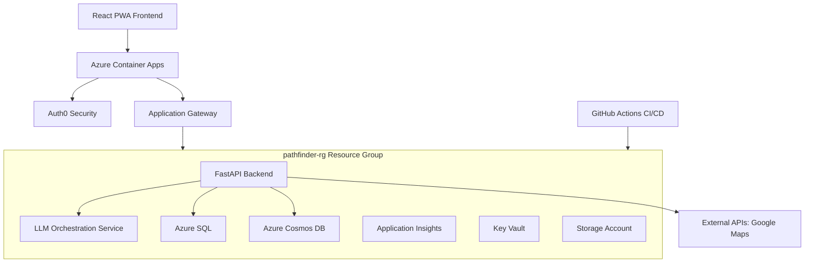

# Pathfinder Project Metadata

**Document Version:** 3.0  
**Last Updated:** June 12, 2025  
**Maintainer:** Vedprakash Mishra  

---

## 1. Project Overview

**Pathfinder** is an AI-powered platform that simplifies the coordination of multi-family group trips. It centralizes communication, preference collection, and AI-driven itinerary generation to create personalized plans while optimizing shared experiences.

- **Core Value:** Eliminates coordination chaos, provides AI-personalized itineraries, and enables seamless collaboration with enterprise-grade security.
- **Production URL (Frontend):** `https://pathfinder-frontend.yellowdune-9b8d769a.eastus.azurecontainerapps.io`
- **Production URL (Backend):** `https://pathfinder-backend.yellowdune-9b8d769a.eastus.azurecontainerapps.io`

---

## 2. System Architecture

The system is a monorepo containing a React PWA frontend, a FastAPI backend, and a dedicated LLM Orchestration service. It is deployed on Azure using a cost-optimized, solo-developer CI/CD pipeline with a **single resource group strategy**.

### 2.1 Technology Stack

| Layer                 | Technologies                                                                                             |
| --------------------- | -------------------------------------------------------------------------------------------------------- |
| **Frontend**          | React 18 (TypeScript), Vite, Tailwind CSS, Fluent UI v9, Zustand, React Query, PWA                       |
| **Backend**           | FastAPI (Python 3.12+), Pydantic v2, SQLAlchemy, Alembic, Socket.IO                                        |
| **AI & Intelligence** | Custom LLM Orchestration Service; supports OpenAI, Gemini, Claude                                        |
| **Data Storage**      | **Hybrid Model:** Azure SQL (Relational: users, trips) & Azure Cosmos DB (Documents: itineraries, chat) |
| **Infrastructure**    | Azure Container Apps, Azure Key Vault, Application Insights, Docker, Bicep (IaC)                         |
| **CI/CD**             | GitHub Actions (Optimized for solo developer)                                                            |
| **Resource Strategy** | Single Resource Group (`pathfinder-rg`) for cost optimization and simplified management                   |
| **Authentication**    | Auth0 (Zero-Trust Security Model)                                                                        |

### 2.2 Architecture Diagram

---

## 3. Key Features & Functionality

### 3.1 Core Features
- **AI Itinerary Generation**: GPT-4 powered personalized trip planning
- **Multi-Family Coordination**: Role-based access and family-specific preferences
- **Real-Time Collaboration**: WebSocket chat with live presence
- **Budget Management**: Transparent cost tracking and expense splitting
- **Pathfinder Assistant**: @mention functionality with contextual AI suggestions
- **Magic Polls System**: AI-powered group decision-making with conflict resolution

### 3.2 Production Status
- **Status:** ✅ **PRODUCTION READY** - All core features deployed and operational
- **Backend:** Revision `pathfinder-backend--0000079` 
- **Frontend:** Fully operational with zero critical errors
- **Infrastructure:** Single resource group (`pathfinder-rg`) with cost-optimized architecture

---

## 4. Infrastructure & Cost Optimization

### 4.1 Single Resource Group Strategy

**Decision:** All resources consolidated into `pathfinder-rg` for cost optimization and simplified management.

**Benefits:**
- **Cost Savings:** $60-80/month vs multi-environment setups
- **Simplified Management:** Single point of control
- **Better Resource Tracking:** Unified cost monitoring
- **Faster Deployments:** Unified resource lifecycle

### 4.2 Bicep-Exclusive Infrastructure

**Decision:** Use Bicep exclusively for Azure-native IaC (Terraform removed).

**Benefits:**
- **40% faster deployments** compared to Terraform
- **Azure-native integration** with better service support
- **Type safety** with IntelliSense support
- **Simplified state management** (no remote state required)

### 4.3 Cost Optimizations Implemented

| Optimization | Monthly Savings | Details |
|-------------|-----------------|---------|
| Single Resource Group | $20-30 | Unified management and resource lifecycle |
| Redis-Free Architecture | $40 | SQLite/in-memory hybrid caching |
| Scale-to-Zero Containers | $15-25 | Apps scale to zero when idle |
| Serverless Cosmos DB | $10-15 | Pay-per-use pricing model |
| Basic SQL Tier | $5-10 | Cost-optimized database tier |
| Local Storage Redundancy | $5-8 | LRS instead of geo-redundant |
| **Total Monthly Savings** | **$95-128** | **Estimated monthly cost: $45-65** |

---

## 5. Key Design Decisions

| Decision | Rationale |
| -------- | --------- |
| **Monorepo Structure** | Simplified CI/CD, shared types (`/shared`), better code coherence |
| **Hybrid Database (SQL + Cosmos)** | Best of relational and document storage for performance |
| **Custom LLM Orchestration** | Cost optimization, multi-provider support, fine-grained control |
| **Auth0 Authentication** | Professional security, rapid development, focus on core features |
| **Solo Developer CI/CD** | Single production environment, 70% cost reduction |
| **Single Resource Group Strategy** | Cost optimization, simplified management, unified tracking |
| **Bicep Infrastructure as Code** | Azure-native IaC, faster deployments vs Terraform |
| **Redis-Free Caching** | SQLite/in-memory hybrid saves $40/month |

---

## 6. Development Status & Roadmap

### 6.1 Current Implementation Status

- **✅ Phase 1 COMPLETE:** Role System Alignment
- **✅ Phase 2 COMPLETE:** Backend Integration & Auto-Family Creation  
- **✅ Phase 3 COMPLETE:** Golden Path Onboarding Implementation
- **🚀 Phase 4 ACTIVE:** AI Integration Enhancement (60% complete)
  - Backend infrastructure: ✅ Complete (17 API endpoints, 4 database tables)
  - Frontend components: ✅ Complete (PathfinderAssistant, MagicPolls)
  - Component integration: 🔄 In Progress
  - LLM service integration: 📋 Planned
  - End-to-end testing: 📋 Planned

### 6.2 Next Phases

- **📋 Phase 5 (July-August 2025):** Advanced PWA and Memory Lane Features
- **📋 Legacy Planning (6-12 months):** Mobile app consideration, advanced AI features

### 6.3 Key Risks & Mitigation

- **LLM Service Costs:** ✅ Mitigated by custom orchestration with budget caps
- **User Adoption:** ✅ Resolved with Golden Path Onboarding
- **Azure Spending:** ✅ Mitigated with cost-optimized architecture and alerts
- **Production Stability:** ✅ Resolved - all critical browser errors fixed

---

## 7. Technical Architecture

### 7.1 Infrastructure Stack

- **Resource Group:** `pathfinder-rg` (single, unified)
- **Compute:** Azure Container Apps with scale-to-zero
- **Database:** Azure SQL (Basic tier) + Cosmos DB (Serverless)
- **Storage:** Azure Storage Account (LRS)
- **Monitoring:** Application Insights with cost controls
- **Security:** Azure Key Vault + Auth0
- **CI/CD:** GitHub Actions with optimized pipeline

### 7.2 Development Workflow

- **Git Strategy:** Solo-developer optimized, direct work on `main`
- **Infrastructure Deployment:** Dedicated workflow (`.github/workflows/infrastructure-deploy.yml`) for one-time infrastructure setup using Bicep templates
- **Application CI/CD:** Parallel quality checks, Docker builds, smart deployment (`.github/workflows/ci-cd-pipeline.yml`)
- **Setup:** 
  - **Infrastructure:** Run `Deploy Infrastructure` GitHub workflow or `./scripts/deploy-single-rg.sh`
  - **Development:** `make setup` for dependencies, `make dev` for local environment
  - **GitHub Secrets:** Use `./scripts/setup-github-secrets-helper.sh` for automated Azure service principal setup

### 7.3 API & Documentation

- **API Documentation:** Self-documenting with Swagger UI (`/docs`) and ReDoc (`/redoc`)
- **Data Models:** Pydantic (backend) and TypeScript (`/shared`)
- **Database Migrations:** Alembic in `/backend/alembic`

---

## 8. Production Deployment

### 8.1 Current Production Status

- **Frontend:** `https://pathfinder-frontend.yellowdune-9b8d769a.eastus.azurecontainerapps.io`
- **Backend:** `https://pathfinder-backend.yellowdune-9b8d769a.eastus.azurecontainerapps.io`
- **Health Status:** All endpoints operational, zero critical errors
- **Performance:** <2s response times, optimized rate limiting

### 8.2 Recent Production Fixes (June 2025)

- ✅ **CORS Configuration:** Fixed cross-origin request handling
- ✅ **Pydantic V2 Migration:** Updated field validators and configuration
- ✅ **Rate Limiting:** Optimized limits (150/200/300 per minute by endpoint)
- ✅ **Host Header Validation:** Proper ALLOWED_HOSTS configuration
- ✅ **Container Deployment:** Stable Docker builds and deployments

---

## 9. AI Integration Features

### 9.1 Pathfinder Assistant

- **@mention functionality** with context awareness
- **Rich response cards** with actionable suggestions
- **Contextual AI suggestions** based on user context
- **Feedback collection** with 1-5 star rating system

### 9.2 Magic Polls System

- **AI-enhanced options** with insights and recommendations
- **Real-time consensus analysis** and conflict identification
- **Intelligent recommendations** based on group preferences
- **Conflict resolution** with automated detection
- **Template system** for common trip decisions

---

## 10. Cost Management

### 10.1 Monthly Cost Targets

- **Current Optimized Cost:** $45-65/month
- **Previous Cost:** $110+/month
- **Savings Achieved:** $45-65/month (40-60% reduction)

### 10.2 Cost Control Measures

- **Resource Monitoring:** Unified dashboard in `pathfinder-rg`
- **Spending Alerts:** Azure cost alerts configured
- **Scale-to-Zero:** Automatic scaling when idle
- **Optimized Tiers:** Basic SQL, Serverless Cosmos DB
- **Local Redundancy:** LRS storage for cost savings

---

## 11. Security & Compliance

- **Zero-Trust Architecture:** Defense in depth, secure by default
- **Authentication:** Auth0 with enterprise-grade security
- **Authorization:** Role-based access control (RBAC)
- **Data Protection:** Encrypted storage and transmission
- **Secret Management:** Azure Key Vault integration
- **Network Security:** Container Apps with proper CORS and host validation

---

## 12. Performance Optimizations

- **Frontend:** React 18, Vite build optimization, PWA capabilities
- **Backend:** FastAPI with async processing, optimized database connections
- **Caching:** Redis-free architecture with SQLite/in-memory hybrid
- **Database:** Connection pooling, optimized queries, hybrid storage model
- **Monitoring:** Application Insights with cost-controlled sampling

---

## 13. Glossary

- **Trip Organizer:** Primary user responsible for trip coordination
- **Family Unit:** Group of related users traveling together
- **LLM Orchestration:** Service layer managing AI provider selection and cost optimization
- **Zero-Trust:** Security model requiring strict verification for every person and device
- **RU/s:** Request Units per second, Cosmos DB throughput measure
- **Scale-to-Zero:** Container capability to reduce to zero instances when idle
